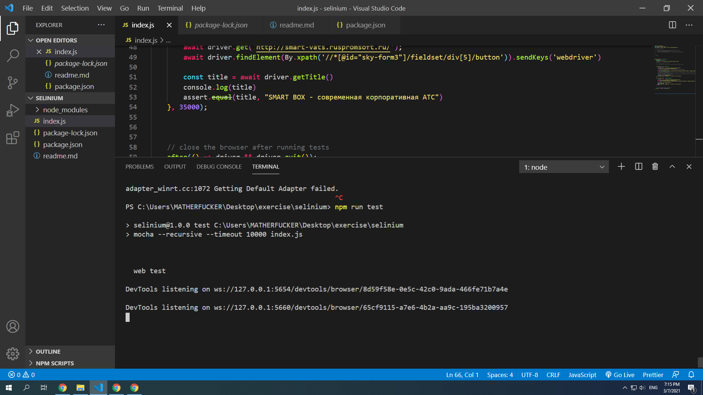

## here is all the test and command for javascript and selenium with mocha test framework

### npm init -y 

### npm install selenium-webdriver

### npm add chromedriver selenium-webdriver

## test swite command line

### npm add mocha -D

#### npm run test

## for install all the dependencies please install
 
### npm run install

### npm run test
